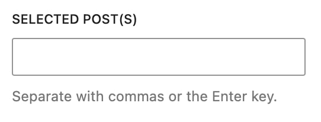
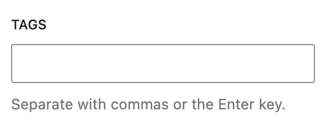

# How to make a block editable ?

There are different ways to make a block editable on WP side. You can use 1 or a combination of those solutions to make the edition of your block the easiest.<br />
All these ways must be handled within the `Edit` component of the `edit.tsx` file of each blocks.

## Edit from WP Sidebar

Everything which is inside `<InspectorControls />` is going to be displayed on the sidebar of WP editor for the selected block.<br />
📚 [Read more about it on Wordpress documentation](https://github.com/WordPress/gutenberg/blob/HEAD/packages/block-editor/src/components/inspector-controls/README.md).

### Wordpress Components

In here any WP component from their library can be used. [See the list of components available on their Storybook](https://wordpress.github.io/gutenberg/?path=/docs/docs-introduction--page).

### Custom components

-   `PostsSelectControl` → To select a list of Posts from a specific Post Type

    ```tsx
    <PostsSelectControl
    	postType={MY_POST_TYPE_NAME}
    	values={postIn || []}
    	label="Selected posts"
    	onChange={(postIn) => onChange({ postIn })}
    />
    ```

    

    <br />

-   `TermsSelectControl` → To select a list of Taxonomies from a specific Taxonomy Type

    ```tsx
    <TermsSelectControl
    	postType={MY_TAXONOMY_NAME}
    	values={categoryIn || []}
    	label="Categories"
    	onChange={(categoryIn) => onChange({ categoryIn })}
    />
    ```

    

## Edit from WP Editor

You can convert any frontend static block into an editable block within WP Editor. To do so, you can use either some WP blocks or a set of custom blocks we've created, within the React Component defined in the `edit.tsx` of your block.

### Wordpress Components

-   `RichText` → to enter some text [(📚 more infos here)](https://github.com/WordPress/gutenberg/blob/trunk/docs/reference-guides/richtext.md)

### Custom components

-   `ButtonEdit` → to add a button or a link

    ```tsx
    <ButtonEdit
    	attrs={link}
    	onChange={(link) => props.setAttributes({ link })}
    	placeholder={_x('My placeholder text', 'Link Placeholder', 'supt')}
    	toolbarPosition="right"
    	rootClass="supt-myBlock__link supt-link"
    />
    ```

-   `ImageEdit` → to add an image

    ```tsx
    <ImageEdit
    	attributes={image}
    	onChange={(image) => props.setAttributes({ image })}
    	isSelected={props.isSelected}
    	ratioWidth={500}
    	ratioHeight={400}
    	className="supt-myBlock__image"
    />
    ```

-   `VideoEdit` → to add a video (from YouTube or Vimeo)

    _/!\ `video`'s value cannot be undefined -- it must be an object by default_

    ```tsx
    <VideoEdit
    	attributes={video}
    	onChange={(attrs: object) =>
    		props.setAttributes({
    			video: { ...video, ...attrs },
    		})
    	}
    	posterOnly
    />
    ```

-   `CharacterLimit` → to add a limit of characters on any text. (📚 [more infos here](../../wordpress/theme/lib/editor/components/CharacterLimit/README.md))

    ```tsx
    <CharacterLimit
    	value={title}
    	limit={140}
    	onChange={(title) =>
    		props.setAttributes({
    			title,
    		})
    	}
    />
    ```

-   `SectionEdit.Uptitle`, `SectionEdit.Title`, `SectionEdit.Introduction` → to handle Sections uptitle, title and/or introduction (📚 [more infos here](../features/helpers.md))

## InnerBlocks

InnerBlocks allows nesting other blocks within a block. Here's how to specify allowed inner blocks and a default template into your editor component.<br />
[📚 Read more about the InnerBlocks component on WP Documentation](https://github.com/WordPress/gutenberg/blob/875628f63a84abc5d60efc727994b75547ab6a5e/packages/block-editor/src/components/inner-blocks/README.md)

#### Definition

(inside your block's `edit.tsx` file)

```tsx
<div className="my-block__content">
	<InnerBlocks
		allowedBlocks={[MyChildBlock.slug]}
		template={[[MyChildBlock.slug], [MyChildBlock.slug]]}
		templateLock={false}
		orientation="horizontal"
	/>
</div>
```

When registering a block which has innerBlocks, you need to change the `save` property of the registration settings :

```tsx
// We must return the InnerBlocks content to the `save` function
export const ExampleBlock: WpBlockType = {
	settings: {
		// Other settings...
		save: () => <InnerBlocks.Content />,
	},
};
```

#### Usage

You now have access to those nested blocks on the frontend through the `children` prop

```tsx
export const MyBlock = ({ children }) => {
	return (
		<div className="my-block">
			<div className="my-block__content">{children}</div>
		</div>
	);
};
```

## Custom controls

Everything which is inside `<BlockControls />` is going to be displayed on the toolbar positionned above the selected block.<br />
📚 [Read more about it on WP documentation](https://github.com/WordPress/gutenberg/tree/trunk/packages/block-editor/src/components/block-controls).

## WP Blocks Inserter

If you want to display a preview of your block when hovering it on the WP Inserter, we've created the `<PreviewBlockImage />` component that will automatically look for a `.jpg` image in the `wordpress/theme/lib/editor/blocks-preview` folder. The name of the image should be the slugified slug of your block. For example, for `supt/my-block` you will need to add the `supt-my-block.jpg` image of your block.

## 🔗 Further reading and resources

-   [WP documentation of a block in the Editor](https://developer.wordpress.org/block-editor/getting-started/fundamentals/block-in-the-editor/)
