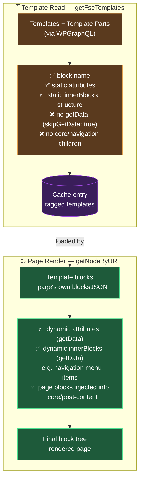

# FSE Templating

This document explains how WordPress Full Site Editing (FSE) templates are handled in this headless stack.

## Overview

WordPress FSE allows editors to define full page layouts — header, footer, content area — using block templates. In this headless setup, Next.js needs to know which template wraps a given page and render those surrounding blocks (header, footer, etc.) alongside the page's own content blocks.

The system works in two steps:

1. **Template read** — a cached read fetches every template and template part from WordPress, and inlines the parts into their templates. It is cached until the `templates` tag is revalidated, so an edit in the Site Editor reaches the site without a deploy.
2. **Page render** — when serving a page, Next.js picks the page's template from that read, injects the page's content blocks into it, and enriches dynamic blocks (navigation, logos, etc.) with their data.

---

## Architecture

```
WordPress
  └─ FSE templates (wp_template)
       └─ FSE template parts (wp_template_part)  ← DB-stored or theme-file
            └─ template blocks

Template read (getFseTemplates)  ← one cache entry, tagged `templates` + `nodes`
  └─ fetches all templates + parts via WPGraphQL
  └─ inlines template parts into parent templates (replaces core/template-part blocks)
  └─ returns the block structure only, no dynamic data

Page render (getNodeByURI)
  ├─ fetches page's own blocksJSON
  ├─ resolves the page's FSE template slug (via fseTemplate GraphQL field)
  ├─ loads template blocks from the template read
  ├─ enriches template blocks via getData calls (navigation links, logos, …)
  └─ injects page blocks into the template's core/post-content block
```

### Visual Schema



**Rule of thumb:**

| What | Where it's resolved |
| --- | --- |
| Template/part **structure** (which blocks, in what order) | Template read |
| Block **static attributes** (set in the editor) | Template read |
| Block **dynamic attributes** (from `getData`) | Page render |
| `innerBlocks` of `core/navigation` (menu items) | Page render (always) |
| `innerBlocks` of any block returning them from `getData` | Page render (overrides the template read) |
| Page's own content blocks | Page render (injected into `core/post-content`) |

---

## Key Files

| File                                                           | Role                                                                  |
| -------------------------------------------------------------- | --------------------------------------------------------------------- |
| `next/src/lib/get-fse-templates.ts`                            | Cached template read: fetches templates + parts, inlines the parts    |
| `next/src/lib/format-blocks-json.ts`                           | Parses & normalises a `blocksJSON` string                             |
| `next/src/lib/get-block-final-component-props.ts`              | Enriches one block (calls `getData`, recurses into `innerBlocks`)     |
| `next/src/lib/get-node-by-uri.ts`                              | Page render orchestration; calls `enrichTemplateBlocks`               |
| `wordpress/theme/includes/graphql/register-fse-templates.php`  | Exposes templates + parts via WPGraphQL                               |
| `wordpress/theme/includes/graphql/navigation-inner-blocks.php` | Exposes `wp_navigation` as `NavigationMenu` with a `blocksJSON` field |

---

## Template Read

`getFseTemplates` (`next/src/lib/get-fse-templates.ts`) is a `'use cache'` function with `cacheLife('max')`, tagged `templates` and `nodes`. It takes no arguments, so every page shares a single cache entry.

**What it does:**

1. Queries `allTemplateParts` — all template parts, including theme-file-based ones that are never stored as DB posts (see [WPGraphQL extension](#wpgraphql-extensions) below).
2. Queries `allTemplates` — all FSE templates (in the same request).
3. For each template, parses its `blocksJSON` with `skipGetData: true` — this stores block structure only, without calling any `getData` function.
4. Replaces every `core/template-part` block with the actual blocks from the matching template part (flattened inline).
5. Returns the templates as `{ slug, blocks }` entries.

> **Important:** `skipGetData: true` means dynamic data (navigation links, site logo, etc.) is **not** part of the template read. This is intentional — those values are fetched when each page is rendered.

> **Failures aren't cached.** When WordPress doesn't answer, the read throws instead of returning no templates, and the page render fails with it: a page is never cached without its header and footer.

> **`core/navigation` specifics:** the WP side does not inline the children of a `core/navigation` block into the template's `blocksJSON`. The template read only contains the `core/navigation` block with its `ref` attribute. The actual menu items are fetched at request time by `Navigation/data.ts`. This avoids stale navigation contents after a menu edit.

---

## Page Render Flow

Inside `getNodeByURI`, after the WP node is fetched, three async operations run in parallel:

```typescript
const [templateBlocks, { blocksJSON, templateData }] = await Promise.all([
	getTemplateBlocks(node?.fseTemplate?.slug, lang).then((blocks) =>
		enrichTemplateBlocks(blocks, lang)
	), // FSE template
	Promise.allSettled([
		formatBlocksJSON(node?.blocksJSON ?? '', { lang }), // page's own blocks
		getTemplateData(node), // template-level extra data
	]).then(/* … */),
]);
```

`getTemplateBlocks` picks the page's template from the cached template read, then `enrichTemplateBlocks` runs `getBlockFinalComponentProps` (with `getData`) on every top-level block. This is where dynamic data (navigation menus, logos, ...) is fetched.

The page blocks are then injected into the template's `core/post-content` block:

```
template: [Header, core/post-content (empty), Footer]
                         ↓ injection
template: [Header, core/post-content { innerBlocks: [...page blocks...] }, Footer]
```

---

## getData Pattern and Dynamic innerBlocks

Each block can export a `getData` function from its `data.ts` file. Normally `getData` returns extra attributes to merge into the block's `attributes`. It can also return an `innerBlocks` array, which **replaces** the static (or empty) `innerBlocks` from the template read.

As an example, this pattern is used for `core/navigation`:

```typescript
// Navigation/data.ts
export const getData = async (fetcher, attrs) => {
	// Fetch the wp_navigation post by DATABASE_ID and parse its blocks
	const data = await fetcher(navigationMenuQuery, {
		variables: { id: String(attrs.ref) },
	});
	const innerBlocks = data?.navigationMenu?.blocksJSON
		? JSON.parse(data.navigationMenu.blocksJSON)
		: [];
	return { innerBlocks }; // innerBlocks overrides the static template blocks
};
```

> The `wp_navigation` post type is exposed in WPGraphQL as `NavigationMenu` via `navigation-inner-blocks.php`, which also registers the `blocksJSON` field (parsed + normalised to the `{ name, attributes, innerBlocks }` shape expected by the frontend).

`get-block-final-component-props.ts` handles this by checking whether `getData` returned `innerBlocks`:

```typescript
if (dataInnerBlocks !== undefined) {
	props.innerBlocks = dataInnerBlocks; // fresh from getData
} else if (blksResult.status === 'fulfilled') {
	props.innerBlocks = blksResult.value; // static from the template read
}
```

> Use this pattern for any block whose `innerBlocks` can change independently of template structure — i.e. content managed outside the template editor.

---

## Refreshing Templates

The template read is refreshed by revalidating the `templates` tag. The revalidate route does it when the nextjs-revalidate plugin reports a `templates` change, that is whenever:

- A template's **structure** changes (blocks added/removed/reordered).
- A template part's **structure** changes.
- A new template or template part is created or translated.

The read is also refreshed by a **Purge all** (the `all` change clears `templates` too). Pages that were rendered with a template carry its `templates` tag, so they are refreshed along with it, on their next request. No rebuild or restart is needed.

Menu links and any other block that returns `innerBlocks` from `getData` aren't part of the template read, so a `templates` change isn't needed for them.

---

## Multilang Template Parts

Template parts (header, footer, ...) can have per-language variants, translated directly in the WordPress site editor via **Polylang Pro's FSE translation support**. Translating a template part creates a second `wp_template_part` post whose slug is suffixed `<slug>___<lang>` (e.g. `footer` → `footer___de`), following Polylang Pro's own naming convention (`PLL_FSE_Template_Slug`, separator `___`). The un-suffixed slug is always the default-language content.

```
footer            ← default language (e.g. fr)
footer___de       ← German translation
footer___it       ← Italian translation
```

**Backend (`register-fse-templates.php`):** the `FseTemplatePart` GraphQL type exposes a `language { baseSlug, code }` field, parsed server-side from the slug via Polylang Pro's own `PLL_FSE_Template_Slug` class — the frontend never re-implements the `___` parsing.

**Template read (`get-fse-templates.ts`):** for every `core/template-part` block, all parts sharing the same `language.baseSlug` are grouped together. The default-language part is inlined into `innerBlocks` exactly as before; every other language variant is attached alongside it as a `translations` map:

```jsonc
{
	"name": "core/template-part",
	"attributes": { "slug": "footer", "area": "footer" },
	"innerBlocks": [ /* default-language blocks */ ],
	"translations": {
		"de": [ /* German blocks */ ]
	}
}
```

This works for any template part, not just the footer — translate any part in the site editor and it's picked up once the `templates` tag is revalidated.

**Page render (`get-node-by-uri.ts`):** `getTemplateBlocks(templateSlug, lang)` walks the loaded template blocks and swaps a `core/template-part` block's `innerBlocks` for `translations[lang]` when present, falling back to the default-language `innerBlocks` otherwise (matching what Polylang Pro itself falls back to when a translation is missing). This substitution happens *before* `enrichTemplateBlocks` runs, so dynamic content nested inside a translated part (e.g. a `core/navigation` block in the footer) still goes through the normal `getData` enrichment pass.

> **Requires Polylang Pro.** With the free Polylang plugin (this starter's default — see [`multilang.md`](./setup/multilang.md)), `PLL_FSE_Template_Slug` doesn't exist, so `language.code` always resolves to an empty string and every template part is treated as default-language. Nothing breaks — the feature just stays dormant until a project installs Polylang Pro.

---

## Adding Dynamic Data to a Template Block

To fetch a template block's data when each page is rendered:

1. Create (or update) `src/components/<category>/<BlockName>/data.ts` and export a `getData` function.
2. Register the block in `src/components/global/blockRegistry.ts` so `get-block-final-component-props.ts` can find it.
3. If the dynamic data lives in `innerBlocks`, return `{ innerBlocks: [...] }` from `getData` — this overrides the static template blocks.
