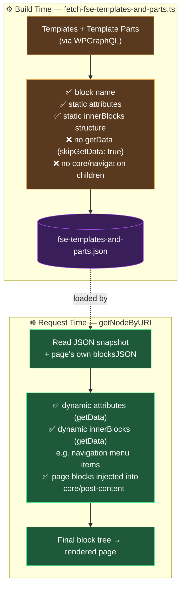

# FSE Templating

This document explains how WordPress Full Site Editing (FSE) templates are handled in this headless stack.

## Overview

WordPress FSE allows editors to define full page layouts — header, footer, content area — using block templates. In this headless setup, Next.js needs to know which template wraps a given page and render those surrounding blocks (header, footer, etc.) alongside the page's own content blocks.

The system works in two phases:

1. **Build time** — a script fetches the template structure from WordPress and stores it in a static JSON file.
2. **Request time** — when serving a page, Next.js reads that JSON, injects the page's content blocks into the template, and enriches dynamic blocks (navigation, logos, etc.) with fresh data.

---

## Architecture

```
WordPress
  └─ FSE templates (wp_template)
       └─ FSE template parts (wp_template_part)  ← DB-stored or theme-file
            └─ template blocks

Build script (fetch-fse-templates-and-parts.ts)
  └─ fetches all templates + parts via WPGraphQL
  └─ inlines template parts into parent templates (replaces core/template-part blocks)
  └─ writes fse-templates-and-parts.json  ← static block structure, no dynamic data

Request time (getNodeByURI)
  ├─ fetches page's own blocksJSON
  ├─ resolves the page's FSE template slug (via fseTemplate GraphQL field)
  ├─ loads template blocks from fse-templates-and-parts.json
  ├─ enriches template blocks via getData calls (navigation links, logos, …)
  └─ injects page blocks into the template's core/post-content block
```

### Visual Schema



**Rule of thumb:**

| What | Where it's resolved |
| --- | --- |
| Template/part **structure** (which blocks, in what order) | Build time → JSON |
| Block **static attributes** (set in the editor) | Build time → JSON |
| Block **dynamic attributes** (from `getData`) | Request time |
| `innerBlocks` of `core/navigation` (menu items) | Request time (always) |
| `innerBlocks` of any block returning them from `getData` | Request time (overrides JSON) |
| Page's own content blocks | Request time (injected into `core/post-content`) |

---

## Key Files

| File                                                           | Role                                                                  |
| -------------------------------------------------------------- | --------------------------------------------------------------------- |
| `next/scripts/fetch-fse-templates-and-parts.ts`                | Build-time script                                                     |
| `next/src/lib/fse/fse-templates-and-parts.json`                | Output: static template snapshot                                      |
| `next/src/lib/format-blocks-json.ts`                           | Parses & normalises a `blocksJSON` string                             |
| `next/src/lib/get-block-final-component-props.ts`              | Enriches one block (calls `getData`, recurses into `innerBlocks`)     |
| `next/src/lib/get-node-by-uri.ts`                              | Request-time orchestration; calls `enrichTemplateBlocks`              |
| `wordpress/theme/includes/graphql/register-fse-templates.php`  | Exposes templates + parts via WPGraphQL                               |
| `wordpress/theme/includes/graphql/navigation-inner-blocks.php` | Exposes `wp_navigation` as `NavigationMenu` with a `blocksJSON` field |

---

## Build-time Script

The script runs automatically as a pre-hook before `dev` and `build`.

Run it manually only when you need to refresh the JSON without restarting the dev server (e.g. after editing a template in WordPress):

```bash
cd next && npx tsx scripts/fetch-fse-templates-and-parts.ts
```

**What it does:**

1. Queries `allTemplateParts` — all template parts, including theme-file-based ones that are never stored as DB posts (see [WPGraphQL extension](#wpgraphql-extensions) below).
2. Queries `templates(first: 99)` — all FSE templates.
3. For each template, parses its `blocksJSON` with `skipGetData: true` — this stores block structure only, without calling any `getData` function.
4. Replaces every `core/template-part` block with the actual blocks from the matching template part (flattened inline).
5. Writes the result to `next/src/lib/fse/fse-templates-and-parts.json`.

> **Important:** `skipGetData: true` means dynamic data (navigation links, site logo, etc.) is **not** stored in the JSON. This is intentional — those values are fetched fresh at request time.

> **`core/navigation` specifics:** the WP side does not inline the children of a `core/navigation` block into the template's `blocksJSON`. The build snapshot only contains the `core/navigation` block with its `ref` attribute. The actual menu items are fetched at request time by `Navigation/data.ts`. This avoids stale navigation contents after a menu edit.

---

## Request-time Flow

Inside `getNodeByURI`, after the WP node is fetched, three async operations run in parallel:

```typescript
const { blocksJSON, templateData, templateBlocks } = await Promise.allSettled([
	formatBlocksJSON(node?.blocksJSON ?? ''), // page's own blocks
	getTemplateData(node), // template-level extra data
	enrichTemplateBlocks(getTemplateBlocks(node?.fseTemplate?.slug)), // FSE template
]);
```

`enrichTemplateBlocks` loads blocks from the JSON snapshot, then runs `getBlockFinalComponentProps` (with `getData`) on every top-level block. This is where dynamic data (navigation menus, logos, ...) is fetched.

The page blocks are then injected into the template's `core/post-content` block:

```
template: [Header, core/post-content (empty), Footer]
                         ↓ injection
template: [Header, core/post-content { innerBlocks: [...page blocks...] }, Footer]
```

---

## getData Pattern and Dynamic innerBlocks

Each block can export a `getData` function from its `data.ts` file. Normally `getData` returns extra attributes to merge into the block's `attributes`. It can also return an `innerBlocks` array, which **replaces** the static (or empty) `innerBlocks` from the JSON.

As an example, this pattern is used for `core/navigation`:

```typescript
// Navigation/data.ts
export const getData = async (fetcher, attrs) => {
	// Fetch the wp_navigation post by DATABASE_ID and parse its blocks
	const data = await fetcher(navigationMenuQuery, {
		variables: { id: String(attrs.ref) },
	});
	const innerBlocks = data?.navigationMenu?.blocksJSON
		? JSON.parse(data.navigationMenu.blocksJSON)
		: [];
	return { innerBlocks }; // innerBlocks overrides the static snapshot
};
```

> The `wp_navigation` post type is exposed in WPGraphQL as `NavigationMenu` via `navigation-inner-blocks.php`, which also registers the `blocksJSON` field (parsed + normalised to the `{ name, attributes, innerBlocks }` shape expected by the frontend).

`get-block-final-component-props.ts` handles this by checking whether `getData` returned `innerBlocks`:

```typescript
if (dataInnerBlocks !== undefined) {
	props.innerBlocks = dataInnerBlocks; // fresh from getData
} else if (blksResult.status === 'fulfilled') {
	props.innerBlocks = blksResult.value; // static from JSON
}
```

> Use this pattern for any block whose `innerBlocks` can change independently of template structure — i.e. content managed outside the template editor.

---

## Updating the JSON

Re-run the build script whenever:

- A template's **structure** changes (blocks added/removed/reordered).
- A template part's **structure** changes.
- A new template or template part is created.

You do **not** need to re-run it when:

- Navigation menu links change (fetched at request time via `navigationMenu { blocksJSON }`).
- Any other block that implements `getData`-returned `innerBlocks` changes.

---

## Adding Dynamic Data to a Template Block

To make a block's data always fresh at request time:

1. Create (or update) `src/components/<category>/<BlockName>/data.ts` and export a `getData` function.
2. Register the block in `src/components/global/blockRegistry.ts` so `get-block-final-component-props.ts` can find it.
3. If the dynamic data lives in `innerBlocks`, return `{ innerBlocks: [...] }` from `getData` — this overrides the static snapshot.
4. Re-run the build script once so the JSON has the correct static structure (the dynamic data will be injected at request time on each visit).
