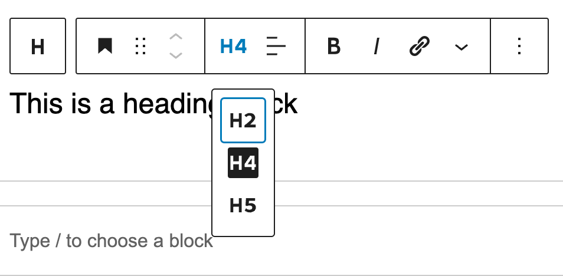

# Block Heading

> [!WARNING]<br />
> Dependencies : This extension relies on the current structure and functionality of the Gutenberg Heading block. Verify compatibility after WordPress updates.

The block heading is an extension of the [core heading block](https://developer.wordpress.org/block-editor/reference-guides/core-blocks/#heading) of wordpress Gutenberg. This extension enhances the default Gutenberg Heading block (`core/heading`), allowing fine-grained control over the heading levels available within inner blocks.

## Why this extension?

The core heading block didn't provide a way to limit the heading levels available to the user inside inner block. Nevertheless, it is a common need to limit the heading levels available to the user in order to maintain a consistent design or content.

The goal of this extension is to provide a way of customizing the heading levels available as inner blocks of a parent block.

## Development Guidelines

### Property

#### `innerBlocksHeadingAvailableLevels`: `number[]`

An array of number, each number being a heading level.

-   Required: No
-   Default: `[1, 2, 3, 4, 5, 6]`

### Usage

If you need to limit the heading levels available to the user within a block, you can use the `innerBlocksHeadingAvailableLevels` property inside the block settings definition. This prop is an array of number, each number being a heading level.

For example, if you want to limit the heading levels to h2 and h3, you can use the following code:

```tsx
export const ExampleAtomsBlock: WpBlockType = {
  slug: block.slug,
  settings: {
    title: block.title,
    description: '',
    icon: 'heading',
    category: 'text',
    postTypes: ['page', 'post'],
    innerBlocksHeadingAvailableLevels: [2, 3],
    ...
  },
};
```

### Design

The default dropdown to select the heading level has been hidden and replaced by a `<ToolbarDropdown />` with the available levels as options.



### Implementation details

We use the `BlockEdit` filter hook to customize the edition of the edit block. Inside this hook we :

-   Check if the heading block is an inner block with the `innerBlocksHeadingAvailableLevels` prop
-   Set the available levels as options for the `<ToolbarDropdown />` component
-   Hide the default dropdown to select the heading level
-   If the current value of the heading level is not in the available levels, we set the value to the first available level

See the [Heading Edit file](edit.tsx) for the complete code.

## Future improvements

-   [ ] Create a plugin or package for the block heading as it is highly dependent of WordPress version
