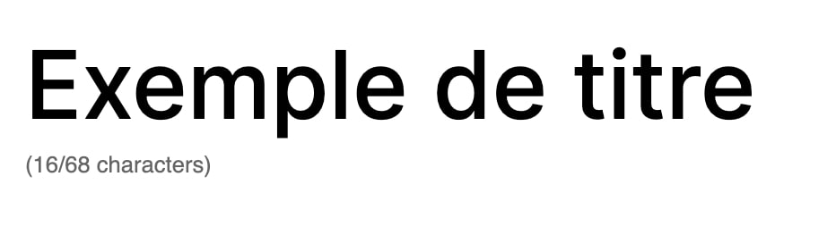

# Character Limit

This component enables to add a limit of characters on any text. It will display a characters counter below the text + automatically block when we've reached the limit.

```tsx
<RichText
  value={title}
  onChange={(title) =>
    props.setAttributes({ title })
  }
/>
<CharacterLimit
  value={title}
  limit={68}
  onChange={(title) =>
    props.setAttributes({
      title,
    })
  }
/>
```

## Example


